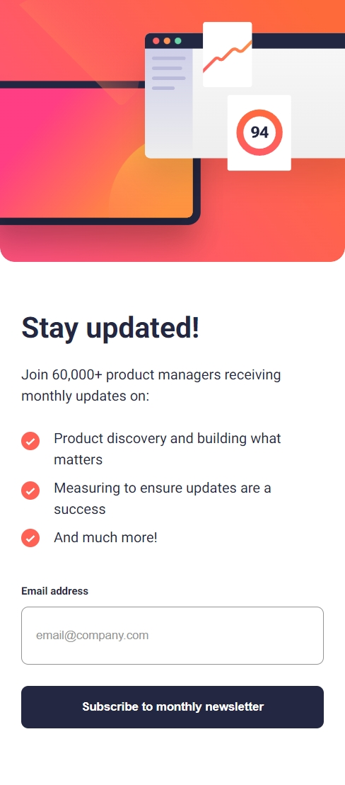

# Frontend Mentor - Newsletter sign-up form with success message solution

This is a solution to the [Newsletter sign-up form with success message challenge on Frontend Mentor](https://www.frontendmentor.io/solutions/newsletter-signup-page-with-basic-dom-manipulation-xZx8t77WhZ). Frontend Mentor challenges help you improve your coding skills by building realistic projects.

## Table of contents

- [Overview](#overview)
  - [The challenge](#the-challenge)
  - [Screenshot](#screenshot)
  - [Links](#links)
- [My process](#my-process)
  - [Built with](#built-with)
  - [What I learned](#what-i-learned)
  - [Continued development](#continued-development)
  - [Useful resources](#useful-resources)
- [Author](#author)

## Overview

### The challenge

Users should be able to:

- Add their email and submit the form
- See a success message with their email after successfully submitting the form
- See form validation messages if:
  - The field is left empty
  - The email address is not formatted correctly
- View the optimal layout for the interface depending on their device's screen size
- See hover and focus states for all interactive elements on the page

### Screenshot

### Links

- Solution URL: [Solution URL](https://www.frontendmentor.io/solutions/newsletter-signup-page-with-basic-dom-manipulation-xZx8t77WhZ)
- Live Site URL: [Live Site URL](https://rishabhsikka3.github.io/newsletter-sign-up-page/)

## My process

### Built with

- Semantic HTML5 markup
- CSS custom properties
- Flexbox
- Mobile-first workflow
- Vanilla JavaScript (ES6+)

### What I learned

During this project, I deepened my understanding of:

- Using the `<picture>` element to serve responsive images based on screen width.
- Creating form validation logic with JavaScript using regex.

### Continued development

Areas I want to focus on in future projects:

- Accessibility practices such as ARIA roles and screen reader support

- Enhancing the UI responsiveness with more precise breakpoints and layouts

- Building reusable components in frameworks like React or Vue

### Useful resources

- [MDN Web Docs - Regex](https://developer.mozilla.org/en-US/docs/Web/JavaScript/Guide/Regular_Expressions) - Helped me understand absolute positioning and containing blocks
- [CSS-Tricks Flexbox Guide](https://css-tricks.com/snippets/css/a-guide-to-flexbox/) - Essential reference for flexbox layouts
- [MDN addEventListener](https://developer.mozilla.org/en-US/docs/Web/API/EventTarget/addEventListener) - Reference for event handling patterns

## Author

- Name – Rishabh Sikka
- Frontend Mentor – [@RishabhSikka3](https://www.frontendmentor.io/profile/RishabhSikka3)
